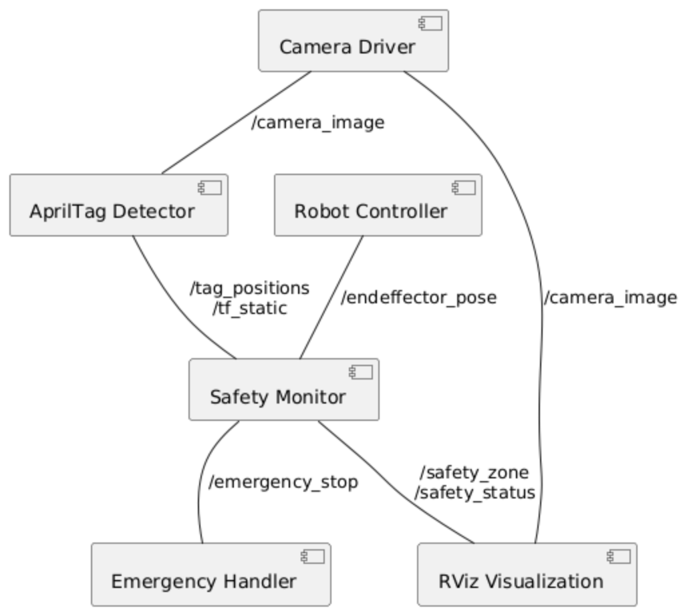

# AprilTag Safety Zone Monitoring System

 <!-- Replace with actual diagram -->

## Overview
This ROS2 node provides real-time safety zone monitoring for robotic arms using AprilTag detection. It dynamically calculates a 3D safety zone based on detected AprilTags and verifies if the robot's end-effector stays within defined boundaries.

## Features
- 🎯 Real-time AprilTag detection with OpenCV
- 📦 Dynamic safety zone calculation
- 🤖 Robot end-effector position tracking
- 🔄 TF-based coordinate transformation
- 🚨 Safety boundary violation detection
- 📊 RViz visualization (Safety zone & markers)

## Dependencies
- **ROS2 Humble**
- OpenCV 4.x
- Python packages:
  ```bash
  pip install apriltag numpy
  sudo apt install ros-humble-vision-opencv ros-humble-tf2-ros \
  ros-humble-geometry-msgs ros-humble-camera-calibration

## installation
- install
  ```bash
  mkdir -p ~/safety_ws/src
  cd ~/safety_ws/src
  git clone https://github.com/Dawengit/Safe-Task-Space-for-Robot-Arm.git
  cd ~/safety_ws
  rosdep install --from-paths src --ignore-src -r -y
  colcon build --symlink-install
  source install/setup.bash
  

## Camera Setup
- calibration
  ```bash
  ros2 run camera_calibration cameracalibrator \
    --size 8x6 \
    --square 0.024 \
    image:=/camera_image
- configuration  

  Update config/camera_params.yaml with calibration results:
  ```bash
  camera_matrix: [1200, 0, 640.5, 0, 1195, 360.5, 0, 0, 1]
  distortion_coefficients: [0.12, -0.25, 0.001, 0.003, 0.15]
  tagsize: 0.035  # Actual tag size in meters

## Robot integartion
- End-Effector Tracking  

  Implement in robot controller:
  ```bash
  class ArmController(Node):
    def __init__(self):
        self.pose_pub = self.create_publisher(PoseStamped, '/endeffector_pose', 10)
    
    def publish_pose(self):
        pose = PoseStamped()
        pose.header.frame_id = "base_link"
        pose.pose = self.get_actual_position()  # Implement robot API call
        self.pose_pub.publish(pose)

- Coordinate Transformation  

  The node handles TF transformations between:

    - Robot base frame (base_link)

    - Camera frame (camera_frame)

    - AprilTag frames (tag_0, tag_1, etc.)

- Verify transformation chain:
    ```bash
      ros2 run tf2_ros tf2_echo base_link camera_frame
## Usage
- launch the system
  ```bash
  ros2 launch apriltag_detection detection.launch.py 
- RViz Monitoring

  Add these displays:

    1. Image: Topic /camera_image

    2. Marker: Topic /safety_zone

    3. TF: Frames base_link and camera_frame

- Operation Tips  

    1. Maintain visibility of at least 4 AprilTags

    2. Recommended tag arrangement: Rectangular pattern

    3. Optimal working distance: 0.5-2 meters from camera


## Reference📌
AprilTag:  
https://github.com/AprilRobotics/apriltag
https://github.com/StanleyChueh/AprilTag_Detection/tree/master

