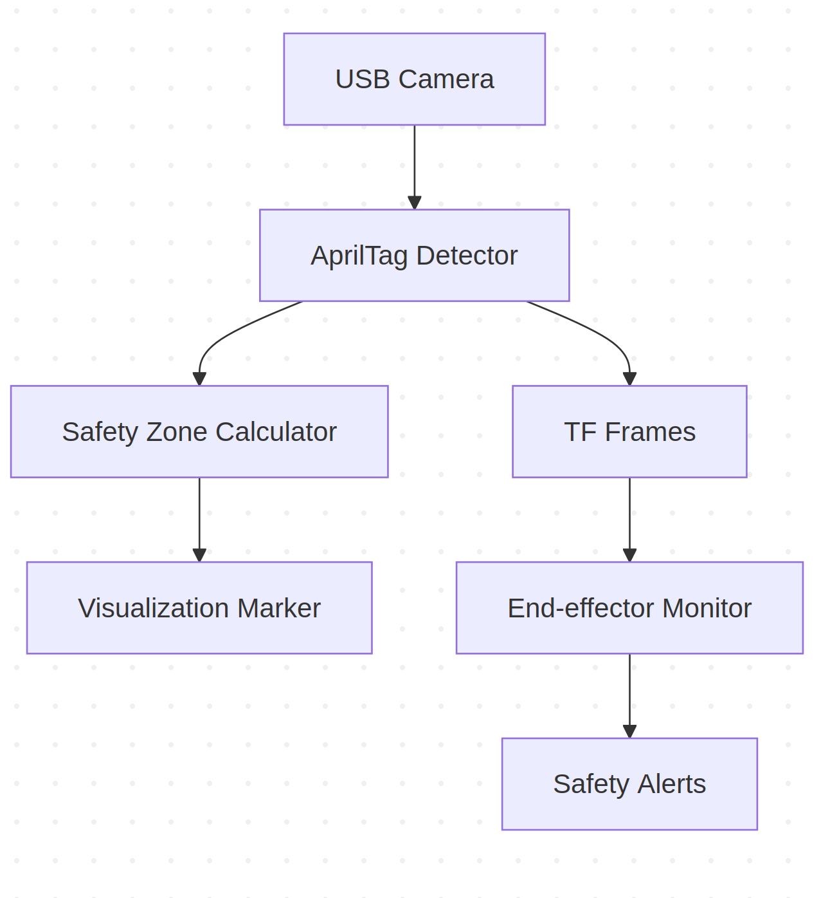

# AprilTag Safety Zone Monitoring System


## Overview
This ROS2 node provides real-time safety zone monitoring for robotic arms using AprilTag detection. It dynamically calculates a 3D safety zone based on detected AprilTags and verifies if the robot's end-effector stays within defined boundaries.

## Features
- 🎯 Real-time AprilTag detection with OpenCV
- 📦 Dynamic safety zone calculation
- 🤖 Robot end-effector position tracking
- 🔄 TF-based coordinate transformation
- 🚨 Safety boundary violation detection
- 📊 RViz visualization (Safety zone & markers)

## System Overview



## Dependencies
- **ROS2 iron**
- OpenCV 4.x
- Python packages:
  ```bash
  pip3 install apriltag 
  pip3 install transforms3d


## installation
- install
  ```bash
  mkdir -p ~/safety_ws/src
  cd ~/safety_ws/src
  git clone https://github.com/Dawengit/Safe-Task-Space-for-Robot-Arm.git
  cd ~/safety_ws
  rosdep install --from-paths src --ignore-src -r -y
  colcon build --symlink-install
  source install/setup.bash
  

## Camera Setup
- Camera Parameters(config/camera_params.yaml)

  For the program to compute the actual distance, you need to get the camera intrinsic parameter(Focal length and Principal point) and apply to the program:
  ```bash
  camera:
    index: 2                # USB camera index
    resolution: [1280, 720] # WxH
    matrix:                 # Intrinsic parameters (pixel)
      fx: 1200              # Focal Length()
      fy: 1195

      cx: 640.5             # Principal Point
      cy: 360.5
    distortion: [0.12, -0.25, 0.001, 0.003, 0.15]

  apriltag:
    size: 0.035            # Tag side length (meters)
    family: "tag36h11"     # Tag family
    ids: [0, 1, 2, 3]      # Target tag IDs

  safety:
    xy_margin: 0.1         # Expansion margin in XY plane
    z_margin: 0.5          # Z-axis safety margin

- camera calibration

  if you use a different camera, you may need to do camera calibration to get the intrinsic value, please refer to this link to continue: https://docs.nav2.org/tutorials/docs/camera_calibration.html


## Robot integartion
- End-Effector Tracking
  
  Change the name of the robot link in the function end_effector_detector  
  ```bash
  try:
            # Lookup transform from camera_frame to finger link
            transform = self.tf_buffer.lookup_transform(
                "camera_frame",  # webcam frame
                "robotiq_85_right_finger_tip_link",  # Change to correct endeffector if needed
                rclpy.time.Time())
  

  
- Coordinate Transformation 

  Change the translation value here to real world setup value
  ```bash
   Node(
            package='tf2_ros',
            executable='static_transform_publisher',
            arguments=[
                '0.0', '0.0', '0.0',  # X/Y/Z translation
                '0', '0', '0',        # roll/pitch/yaw
                'ur5e_base',      # father frame
                'camera_frame'        # son frame
            ],
            name='camera_tf_publisher'
        ),
  
- Verify transformation chain

    This will show the name and structure of the TF frame.
    ```bash
      ros2 run tf2_ros tf2_echo base_link camera_frame
      
## Usage
- launch the system
  ```bash
  ros2 launch apriltag_detection detection.launch.py 
- RViz Monitoring

  Adjust these displays:

    1. Image: Topic /camera_image

    2. Marker: Topic /safety_zone

    3. TF: Frames base_link and camera_frame

- Operation Tips  

    1. Maintain visibility of at least 4 AprilTags

    2. Recommended tag arrangement: Rectangular Pattern

    3. Optimal working distance: 0.5-1.5 meters from camera(For laser cutting 3.5cm) You may adapt to different size tag to get longer working distance.


## Reference📌
AprilTag:  

https://github.com/AprilRobotics/apriltag

https://github.com/StanleyChueh/AprilTag_Detection/tree/master

